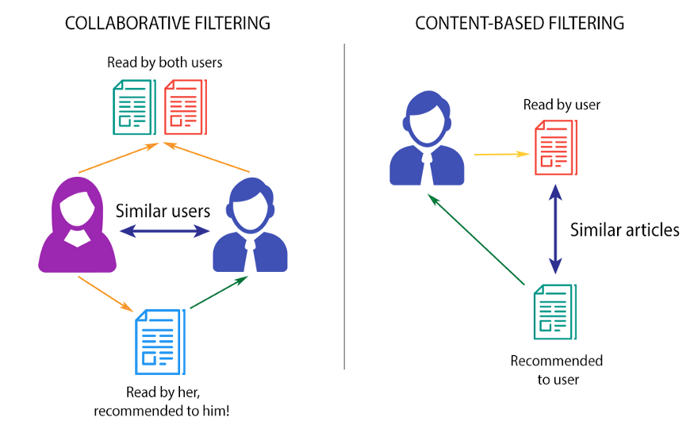

<!-- PROJECT LOGO -->
 

  

  <h2 align="center">Систем за рекомендирање</h2>

  

    Користејќи КNN и softmax DNN
  

## Вовед

Системите за рекомендирање, се изградени на базата на податоци на MovieLens со 25 милиони оценки за филмови. Овие системи за препораки беа изградени со користење на операциите на Pandas и со поставување на модели на KNN и длабоко учење кои користат NLP техники и NN архитектура за да предлагаат филмови за корисниците врз основа на слични корисници.

Системот за препораки е подкласа на систем за филтрирање на информации што се обидува да ја предвиди оцената што корисникот би му ја дал на предметот. Системите за препораки се користат во различни области, вклучувајќи филмови, музика, вести, социјални ознаки и производи воопшто. Системите за препораки обично произведуваат листа на препораки и има неколку начини на кои може да се направи. Два од најпопуларните начини се - преку колаборативно филтрирање или преку филтрирање базирано на содржина.

Повеќето интернет производи што ги користиме денес се напојувани од системи за препораки. YouTube, Netflix, Amazon и долгата листа на други производи на интернет се потпираат на системите на препорачувачи за да филтрираат милиони содржини и да даваат персонализирани препораки до нивните корисници. Системите за препораки се добро проучени и докажани дека обезбедуваат огромни вредности за интернет бизнисите и нивните потрошувачи.

Постојат главно пет типа на системи за препораки кои работат првенствено во индустријата за медиуми и забава:

* Колаборативен систем за препораки
* Систем за препораки базиран на содржина
* Систем за препораки базирани на знаење
* Хибриден систем за препораки
* Демографски базиран систем за препораки

### Систем за препораки базиран на содржина

Овој пристап користи низа дискретни карактеристики на ставката со цел да препорача дополнителни ставки со слични својства. Методите за филтрирање базирани на содржина се засноваат на опис на ставката и профил на преференциите на корисникот. За да биде едноставно, ќе ви предложи слични филмови засновани на филмот што го даваме (името на филмот би било влезно) или врз основа на сите филмови што ги гледал корисникот (корисникот е влезот). Извлекува карактеристики на ставка и исто така може да ја погледне историјата на корисникот за да дава предлози.

### Колаборативен систем за препораки

Колаборативното филтрирање се заснова на претпоставката дека луѓето кои се согласиле во минатото ќе се согласат во иднина и дека ќе им се допаднат слични видови ставки како што сакале во минатото. Системот генерира препораки користејќи само информации за профилите за оценување за различни корисници или ставки. Со лоцирање на колеги корисници/ставки со историја на оценување слична на тековниот корисник или ставка, тие генерираат препораки користејќи го ова соседство. Овој пристап гради модел од минатото однесување на корисникот (предмети претходно купени или избрани и/или нумерички оценки дадени на тие ставки) како и слични одлуки донесени од други корисници. Овој модел потоа се користи за предвидување ставки (или оценки за ставки) за кои корисникот може да има интерес. Методите на заедничко филтрирање се класифицирани како базирани на меморија и базирани на модели.

## Заеднички предизвици

Во овој проект, две од горенаведените системи за препораки беа изградени со користење на различни алгоритми. Следниве предизвици се сретнаа при градењето на овие системи за препораки:

* ладен почеток
* оскудност на податоците
* популарна пристрасност (како да препорачате производи од опашката на дистрибуцијата на производот)
* приспособливост (пресметувањето расте како што расте бројот на корисници и ставки)

Графикот е распределбата на фреквенцијата на оценување на ставките. Оваа дистрибуција често задоволува својство во реални поставки, што се нарекува својство на [долга опашка](https://www.springer.com/cda/content/document/cda_downloaddocument/9783319296579-c1.pdf?SGWID=0-0-45-1554478-p179516130). Според ова својство, само мал дел од ставките се често оценети. Таквите предмети се нарекуваат популарни предмети. Огромното мнозинство на ставки ретко се оценуваат.

Во повеќето случаи, артиклите со висока фреквенција имаат тенденција да бидат релативно конкурентни ставки со мал профит за трговецот. Од друга страна, ставките со пониска фреквенција имаат поголеми профитни маржи. Сепак, многу алгоритми за препораки имаат тенденција да предлагаат популарни ставки наместо ретки ставки. Овој феномен, исто така, има негативно влијание врз различноста, а на корисниците честопати може да им биде здодевно со примање на истиот пакет препораки за популарни ставки.

## [Систем за препораки на филмови користејќи КNN](https://github.com/vasetrendafilov/recommender-system/blob/main/knn-25m.ipynb)

KNN алгоритам се користи за одредување на соодветниот сличен филм врз основа на косинусова сличност. Се враќа саканиот број на најблиски соседни филмови/корисници. Збирките на податоци се вчитани. Се создава нова база на податоци од постојната споена база на податоци со групирање на уникатната корисничка идентификација и комбинација на наслов на филмот и се остранува шумот. 

Ги трансформираме податоците на таков начин што секој ред од податочната рамка претставува филм, а секоја колона претставува различен корисник. Бидејќи знаеме дека не сите корисници ги гледаат сите филмови, можеме да очекуваме многу вредности што недостасуваат. Ќе треба да ги пополниме тие забелешки кои недостасуваат со 0, бидејќи ќе извршиме линеарни алгебарски операции (пресметување растојанија помеѓу вектори).

Конечно, ние ги трансформираме вредностите на податочната рамка во матрица за најефикасните пресметки. Оваа податочна рамка потоа се внесува во модел на KNN. Потоа наоѓаме одреден број на слични корисници кои се на најблиско растојание од корисникот што сакаме да му препорачаме филмови.

Еден начин би бил со земање на просекот од постојните оценки дадени од слични корисници и избирање на најдобрите н филмови што ќе ги препорачаме на нашиот сегашен корисник. Но, сметам дека препораката би била поефикасна ако ги дефинираме тежините на оценките од секој сличен корисник врз основа на нивното растојание од влезниот корисник. Дефинирањето на овие тежини ќе ни даде точни препораки со елиминирање на можноста за манипулација со одлуки од страна на корисниците кои се релативно многу далеку од влезниот корисник. Последно е филтрирање на филмовите со цел да се тргнат веке изгледаните филмови од корисникот.

 
## [Recommender System using Softmax Deep Neural Networks](https://github.com/vasetrendafilov/recommender-system/blob/main/dnn-25m.ipynb)

Горенаведените ограничувања на празните места во матрицата може да се решат со помош на моделите на длабока невронска мрежа. Поради флексибилноста на влезниот слој на мрежата, DNN може лесно да вградат карактеристики на барање и карактеристики на ставки кои можат да помогнат да се доловат специфичните интереси на корисникот и да се подобри релевантноста на препораките.

За овој проект, Softmax длабоки невронски мрежи се користат за да се препорачаат филмови. Корисниците и филмовите се еднократно кодирани со помош на ембединг слој и внесени во длабоката нервна мрежа бидејќи различни различни влезови и оценки се дадени како излез.

Моделот на длабока невронска мрежа е изграден со [ембединг](https://medium.com/analytics-vidhya/understanding-embedding-layer-in-keras-bbe3ff1327ce) слојот што ни овозможува да го претвориме секој збор во вектор со фиксна должина и ни помага да ги претставиме зборовите на подобар начин заедно со намалените димензии. Потоа на крајот беа наредени густи слоеви со испуштање и на крајот густ слој со 9 неврони (по еден за секоја можна оцена од 1 до 5 ) со функцијата за активирање softmax.

Како функционира овој DNN модел е, потребни се два влеза, еден од влезот има кориснички ID, а другиот има соодветни ID на филм. Овде моделот DNN се обидува да ги предвиди рејтинзите на комбинацијата корисник - филм. Значи, можеме да внесеме специфичен кориснички ID и ID на невиден филм на корисникот и да очекуваме моделот да ги даде оценките на филмовите кои би биле оценките дадени од корисникот. Овде, оценките се веќе нормализирани и бидејќи ни се потребни филмовите што повеќе го интересираат корисникот, оценките не се враќаат на скалата 0-5.

<!-- LICENSE -->
## License

Distributed under the MIT License. See `LICENSE` for more information.

<!-- CONTACT -->
## Contact

Vase Trendafilov - [@TrendafilovVase](https://twitter.com/TrendafilovVase) - vasetrendafilov@gmail.com

Project Link: [https://github.com/vasetrendafilov/recommender-system](https://github.com/vasetrendafilov/recommender-system)